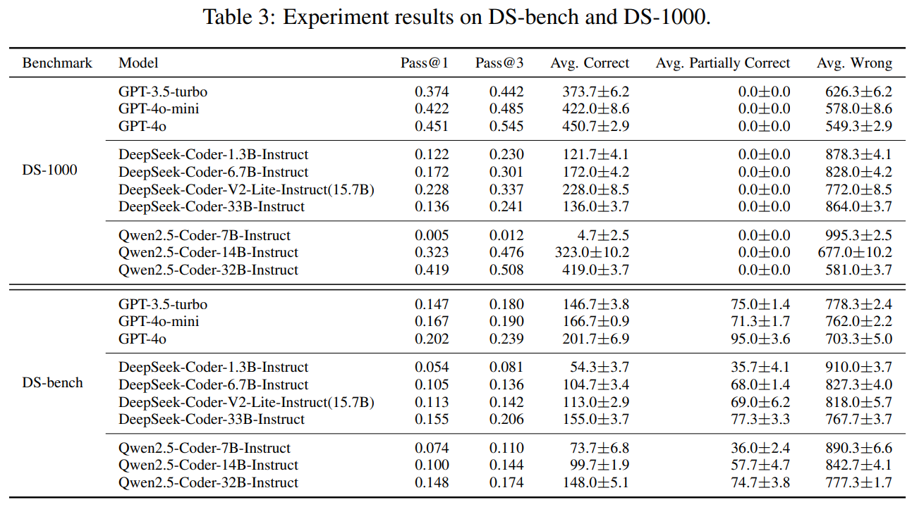

# DS-Bench: A Realistic Benchmark for Data Science Code Generation

##  :round_pushpin: Abstract
We introduce DS-bench, a new benchmark designed to evaluate large language models (LLMs) on complicated and realistic data science code generation tasks.
DS-bench consists of 1,000 carefully constructed problems sourced from realistic problems from GitHub across ten widely used Python data science libraries.
Compared to the current state-of-the-art benchmark DS-1000, 
DS-bench offers a more challenging and representative testbed, longer code solutions, more comprehensive data science libraries, clearer and better structured problem descriptions, and stronger test suites.
To construct the DS-bench, we develop a robust pipeline that combines task scope selection, code construction, test case generation, and problem description synthesis.
The process is paired with rigorous manual editing to ensure alignment and enhance evaluation reliability.
Experimental result shows that DS-bench exhibits robust scaling behavior, where larger models systematically outperform smaller ones, validating its ability to distinguish model capabilities.
The best LLM we test, GPT-4o, has a pass@1 of 0.202, indicating that LLMs still have a large room to improve for realistic data science code generation tasks. 
We believe DS-bench will serve as a rigorous and trustworthy foundation for advancing LLM-based data science programming.

## :rocket: Updates
**05/12/2025:** Code released

## Benchmark

You could directly download the benchmark from `DS_bench.json`.
Besides, we also offer a 'cheated' version of our benchmark `DS_bench_with_additional_logic.json`, with additional logic description of the ground truth code in the code problem description.

## Benchmark Construction Pipeline

Detailed code of benchmark construction can be found in the folder `benchmark_construction`

## Results
Our experiment results are stored in the folder `experiment_result`.

## Contribution

We warmly welcome feedback and contributions from the broader AI and Software Engineering research communities. Whether you'd like to open an issue or submit a pull request, please use the appropriate template to help us respond effectively. We look forward to your input and will follow up promptly!

Contact person: [Shuyin Ouyang](https://sites.google.com/view/shuyinouyang)
